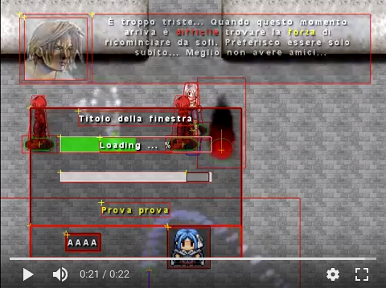

# 2010 - VGE (memories from my past)

An RPG Game Engine with support for tilemaps, polygon detection collision, 3D sound,
particle effects, bitmap fonts, multiple UI widgets, storable entities, and other shit.

I was 20 years old at the time and this was the first of three attempts to build a full game engine from scratch.

## Technologies

* SDL - https://www.openal.org/;
* OpenGL;
* OpenAL - https://www.openal.org/;
* libsigc++;
